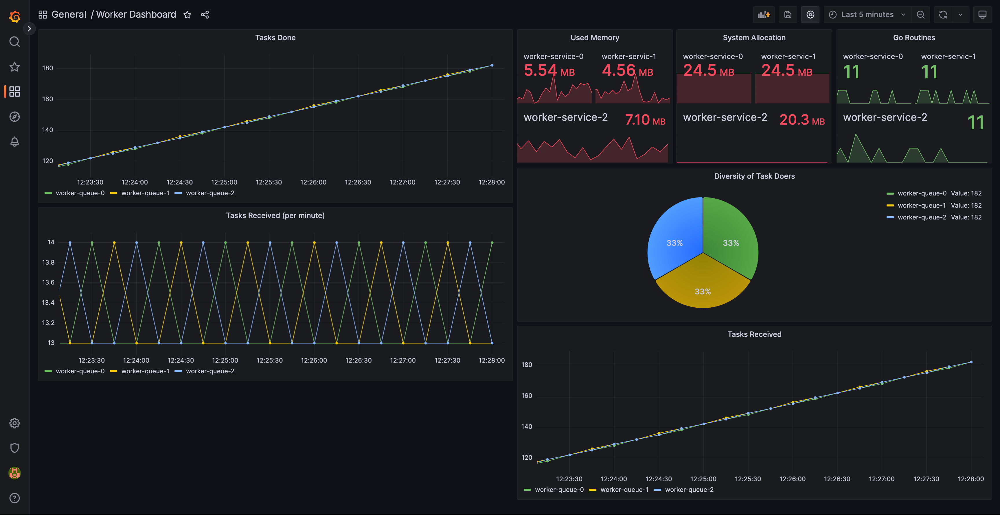

# SternX Project


## Introduction

The whole structure is based on clean architecture packaging is by technology approach. Although the preferable one is
packaging by
feature which is more scalable.
As a matter of Clean Code & Architecture, OOP, SOLID principles there are many situations in code that can be revised
but for the sake of time limitation deferred to the future.

## Usage

### Docker

To start project by docker in the root of project simple run:

```
docker compose up
```
All these stacks start coming up:
* Producer 
* Distributor
* Workers (3 in default)
* Grafana
* Prognathous
* RabbitMQ

### Make

You can run each application separately by make command but before make sure that your `rabbitmq-server` is running
,and you have installed `go` on your machine:

```
make start
```

## Monitoring

For the sake of monitoring, I just add some metrics to track number of tasks each worker receive and done. Due to
limited deadline I decided to just add metrics to workers. The Grafana file is inside this directory:
`worker/development/grafana/worker-dashboard.json`.

.

## Architecture

Based of clean architecture I divide the whole application into tree main sections:

* app
* domain
* infra

For the sake of decoupling, all tech related components goes in to `infra` and the business logic relies on `domain`
section. the `app` section also is responsible for swing both `domain` and `infra` layers.

## Components

I decided to add some extra components to deliver high quality application. These components are:

#### Retry Pattern

On connecting to the redis for instance, application seeks the connection process for some times fulfill the job. But
this could be used also in database queries.

#### Auto Healer Mechanising

In an cloud native environment, applications should keep themselves up as could as possible. This cloud be one of
components to keep infra connections heal themselves if the connection is lost in runtime by creating new connection and
substitute with prior one.

## Drawbacks

I've tried to deliver a high quality code. But still there are some drawback that due to the limited time I decided
to put it off. 
